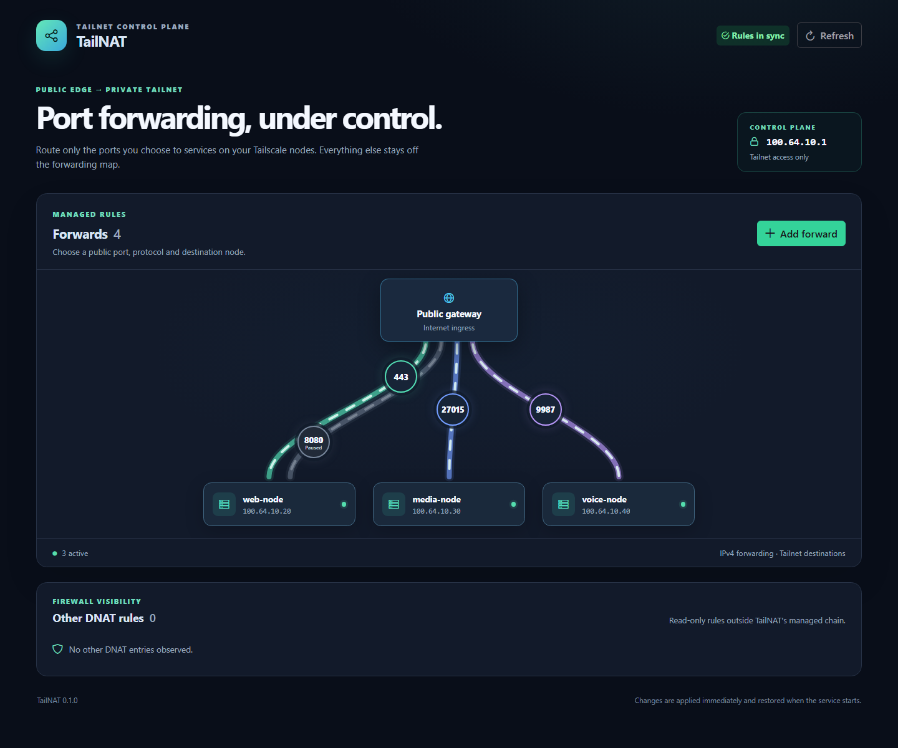
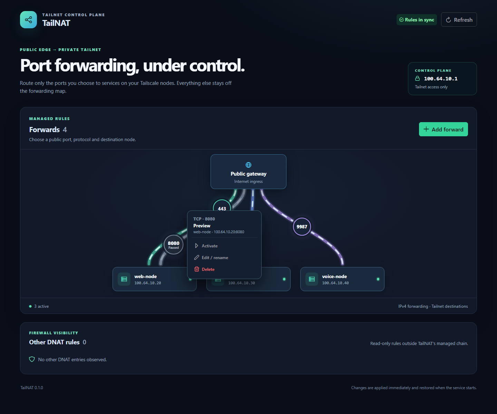

<p align="center">
  
</p>

<h1 align="center">TailNAT</h1>

<p align="center"><strong>One public edge. Your tailnet. Only the ports you choose.</strong></p>

<p align="center">🦀 Rust API &nbsp;·&nbsp; 🖥️ Vue dashboard &nbsp;·&nbsp; 🔀 TCP + UDP &nbsp;·&nbsp; 🔒 Tailnet-only control plane</p>

TailNAT turns a public Linux gateway into a selective front door for services running on Tailscale peers. Pick a public port, choose a node, and let TailNAT manage the matching IPv4 DNAT, forwarding, and return-path rules. No Tailscale API token required.



<details>
<summary>👆 See the controls for a paused forward</summary>



</details>

<sub>📸 Real dashboard, illustrative data. No production nodes or addresses are shown.</sub>

## ✨ What you get

- **A visual forwarding map.** Create, edit, pause, and delete TCP/UDP forwards without hand-editing iptables rules.
- **Live tailnet discovery.** Pick from nodes reported by `tailscale status --json`, with online state visible in the dashboard.
- **Firewall reconciliation.** TailNAT owns only its `TAILNAT_*` chains, checks for drift, and restores configured rules when the service starts.
- **A private control plane.** The HTTP server binds to the gateway's Tailscale IPv4 address, checks callers with Tailscale WhoIs and an `allowed_users` list, and rejects cross-origin writes.
- **Read-only visibility beyond TailNAT.** See other observed DNAT entries without taking ownership of them.
- **A small integration API.** Every dashboard operation is available through the documented JSON HTTP API.

```text
Internet ── TCP/UDP :port ──▶ public Linux gateway
                                │  TailNAT-managed iptables rules
                                ▼
                           Tailscale peer :port

Your tailnet ────────────────▶ private TailNAT dashboard + API
```

## 🚀 Get started

You need a Linux gateway with a public IPv4 interface, Tailscale, `iptables` with conntrack support, IPv4 forwarding, and systemd. The project currently targets IPv4 ingress and IPv4 Tailscale destinations.

Build the frontend and backend:

```sh
cd frontend
npm ci
npm run build

cd ../backend
cargo test --locked
cargo build --release --locked
```

For a Debian 12 gateway, build the Rust binary in a Debian 12-compatible environment (or use a compatible static target). Start from [`deploy/config.example.json`](deploy/config.example.json), then follow the [deployment guide](docs/DEPLOYMENT.md) for installation, firewall migration, verification, and rollback.

## 🧭 How it behaves

1. TailNAT resolves the gateway's Tailscale IPv4 address and listens there—not on its public interface.
2. An authorized tailnet user selects a peer and a TCP or UDP port in the dashboard or API.
3. The service validates the rule, saves desired state, and reconciles only its own iptables chains.
4. Public traffic on that port is forwarded to the peer over Tailscale. Unlisted public-to-tailnet traffic is dropped by TailNAT's forwarding chain.

TailNAT does **not** configure a default-deny firewall for services running on the gateway itself. Existing NAT rules outside its chains remain the administrator's responsibility. A forwarded service is public: secure that service accordingly.

## 📚 Documentation

- [HTTP API reference](docs/API.md) — endpoints, request bodies, responses, and errors.
- [Deployment guide](docs/DEPLOYMENT.md) — prerequisites, systemd, migration, verification, updates, and rollback.
- [Example configuration](deploy/config.example.json) and [systemd unit](deploy/tailnat.service).

Keep real tailnet names, login identities, addresses, and production config out of a public repository. This project ships only generic examples and a screenshot with sample data.

## 🛠️ Stack & scope

Rust + Axum power the API and firewall reconciler; Vue 3 + TypeScript + PrimeVue Aura power the dashboard. TailNAT is intentionally focused on **selected IPv4 TCP/UDP port forwards**. It is not a full firewall manager, reverse proxy, or IPv6 translator.

MIT licensed — see [LICENSE](LICENSE).
